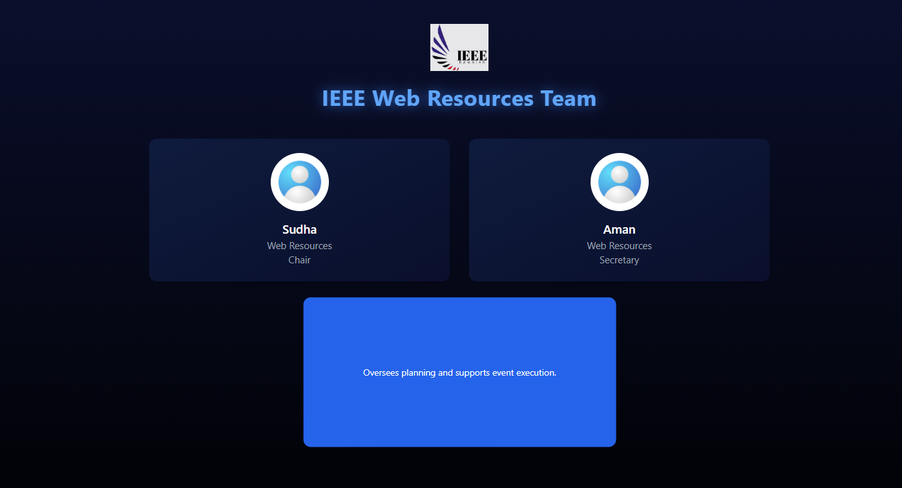

# React + Vite

This template provides a minimal setup to get React working in Vite with HMR and some ESLint rules.

Currently, two official plugins are available:

- [@vitejs/plugin-react](https://github.com/vitejs/vite-plugin-react/blob/main/packages/plugin-react) uses [Babel](https://babeljs.io/) (or [oxc](https://oxc.rs) when used in [rolldown-vite](https://vite.dev/guide/rolldown)) for Fast Refresh
- [@vitejs/plugin-react-swc](https://github.com/vitejs/vite-plugin-react/blob/main/packages/plugin-react-swc) uses [SWC](https://swc.rs/) for Fast Refresh

## React Compiler

The React Compiler is not enabled on this template because of its impact on dev & build performances. To add it, see [this documentation](https://react.dev/learn/react-compiler/installation).

## Expanding the ESLint configuration

If you are developing a production application, we recommend using TypeScript with type-aware lint rules enabled. Check out the [TS template](https://github.com/vitejs/vite/tree/main/packages/create-vite/template-react-ts) for information on how to integrate TypeScript and [`typescript-eslint`](https://typescript-eslint.io) in your project.

## UI Preview

### Normal View

### Hover View

**TASK 3:**

PART A:
**Corrected code:**
function Counter() {
  let count = 0;

  const handleIncrement = () => {
    count = count + 1;
    console.log("Count is now: " + count);
    document.getElementById('display').innerText = count;
  };

  for (let i = 0; i < 3; i++) {  // changed var → let
    setTimeout(() => {
      console.log("Iteration: " + i);
    }, 1000);
  }
}

**Explanation**
var shares the same variable inside a loop,
which can cause unexpected results.
let creates a new variable for each loop iteration,
so it works correctly especially with things like setTimeout.

PART B:
**Corrected Code**
const express = require('express');
const app = express();
app.get('/user/:id', async (req, res) => {// made async
  try {
    const userData = await fetchUserFromDB(req.params.id);// added await
    if (!userData) {
      return res.status(404).send("User not found");// added return
    }
    res.json({
      status: "success",
      data: userData   // fixed typo
    });
  } catch (error) {
    res.status(500).send("Server Error: " + error.message);
  }
});
async function fetchUserFromDB(id) {
  return { id, name: "IEEE Member" };
}

**Explanation**
The function that gets user data was not properly waited for,
so it could cause wrong output.
There was also a small spelling mistake in the variable name. 
Additionally, the code did not stop after sending a 404 error, 
which could cause another response to be sent.

